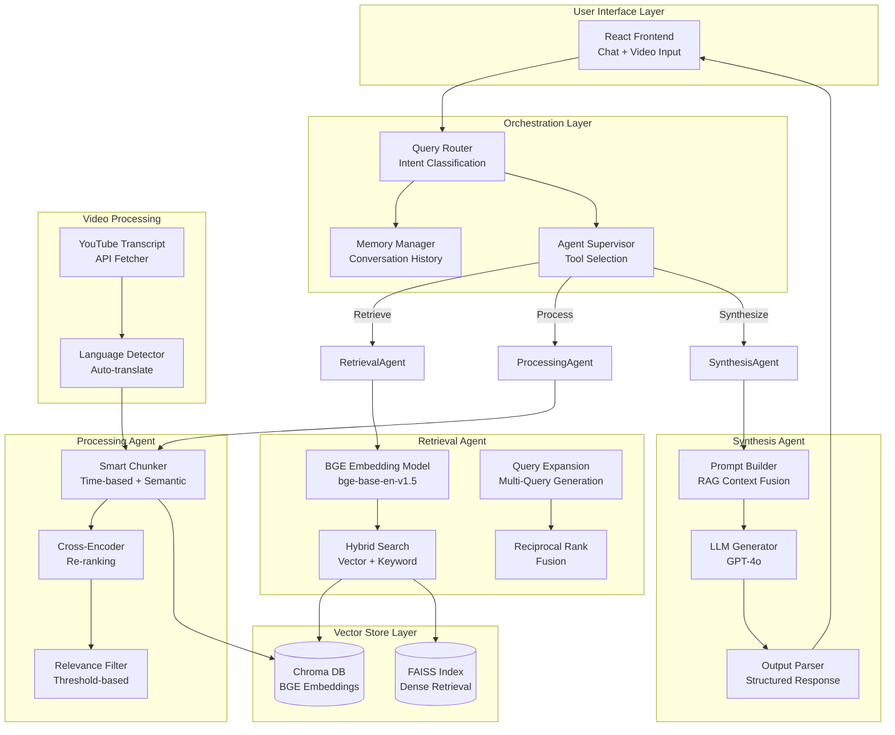
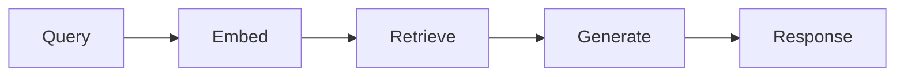
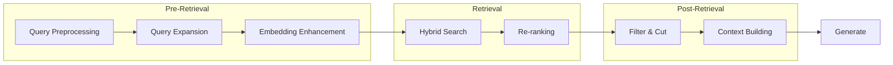
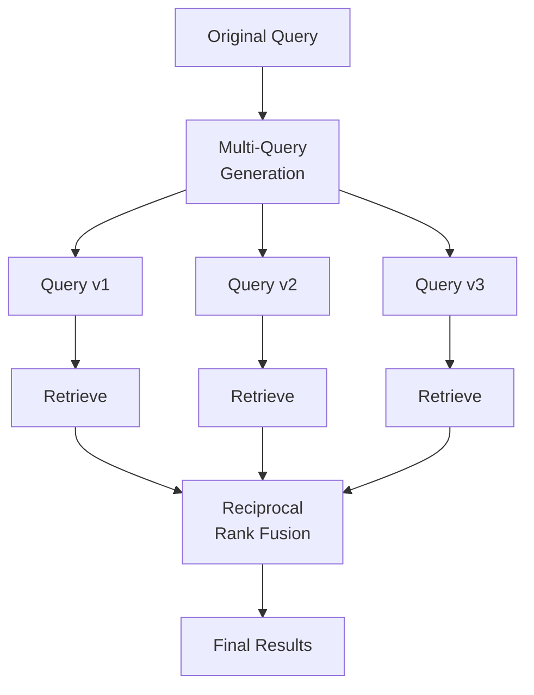
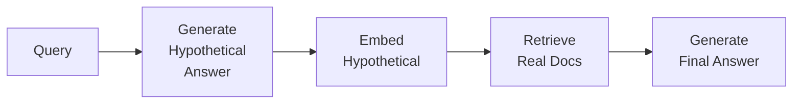
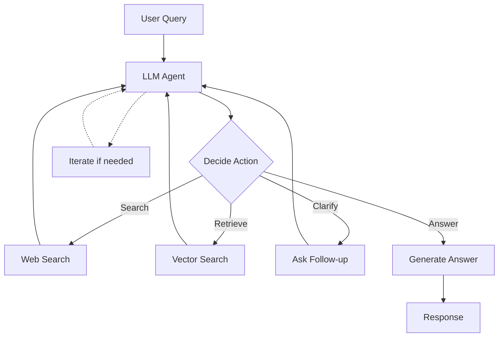
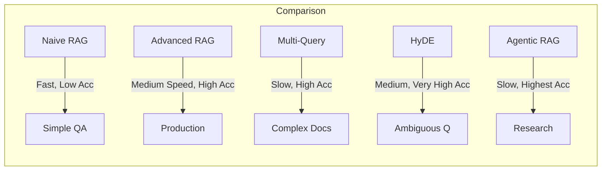
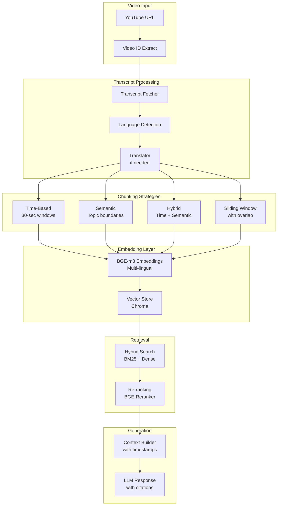
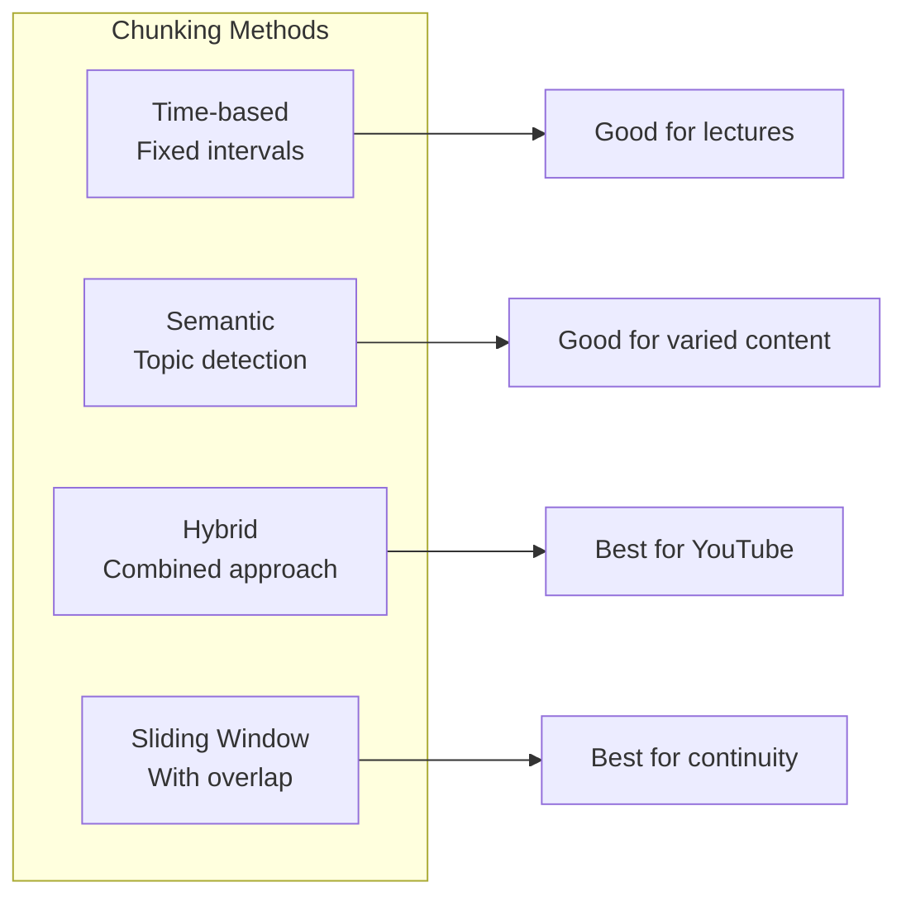
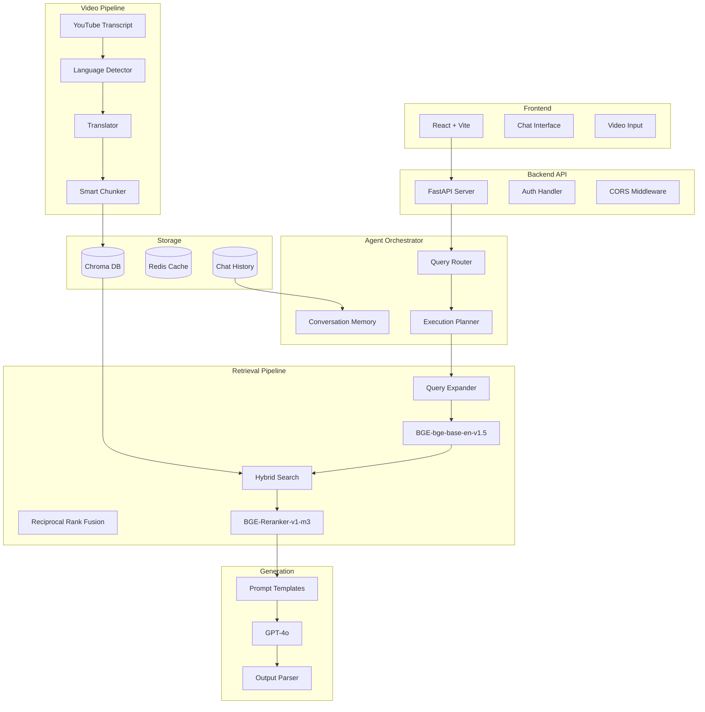

# YouTube AI Chatbot 🤖📺

**Created by Abhishek**

An intelligent chatbot that watches YouTube videos and answers questions about their content using advanced AI techniques.

---

## 🎯 Features

- **YouTube Video Analysis**: Automatically fetch and process transcripts from any YouTube video
- **Multi-Agentic RAG**: Specialized agents for retrieval, processing, and synthesis
- **BGE Embeddings**: State-of-the-art BGE (BAAI General Embedding) for semantic search
- **Advanced RAG Methods**: Multi-Query, HyDE, Agentic RAG, and more
- **Video RAG**: Specialized chunking and retrieval for video content
- **Vector Store**: Chroma-based embeddings for semantic search
- **Multi-language Support**: Automatic transcript language detection and translation
- **Modern UI**: Sleek dark-themed React frontend with smooth interactions

---

## 🧠 Advanced Multi-Agentic RAG Architecture

This project implements a sophisticated multi-agent RAG system using BGE embeddings and advanced retrieval methods.

### Mermaid Diagram: Multi-Agentic RAG System



---

## 🔄 Advanced RAG Methods

### 1. Standard RAG (Naive RAG)



### 2. Advanced RAG Pipeline



### 3. Multi-Query RAG



### 4. HyDE (Hypothetical Document Embeddings)



### 5. Agentic RAG



---

## 📊 RAG Method Comparison



---

## 🎬 Video RAG Specific Implementation

### Mermaid: Video RAG Pipeline



### Video Chunking Strategies



---

## 🏗️ Complete System Architecture



---

## 📝 Option B Explanation - Golden Dataset for RAG

Based on the assignment in [`1.txt`](1.txt), this project implements Option B - a Golden Dataset for RAG evaluation:

### Task Overview
Build a thoughtful evaluation set from 4 neural network/deep learning videos to test RAG system performance.

### Videos Used
1. **3Blue1Brown** - But what is a Neural Network? - `aircAruvnKk`
2. **3Blue1Brown** - Transformers, the tech behind LLMs - `wjZofJX0v4M`
3. **CampusX** - What is Deep Learning? (Hindi) - `fHF22Wxuyw4`
4. **CodeWithHarry** - All About ML & Deep Learning (Hindi) - `C6YtPJxNULA`

### Implementation in This Project
The project includes [`golden_dataset_option_b.py`](Youtube-Chatbot-main/Backend/golden_dataset_option_b.py) which:

1. **Fetches Transcripts** using YouTube Transcript API
2. **Processes Content** with text chunking strategies
3. **Generates QA Pairs** covering:
   - Neural network fundamentals
   - Deep learning concepts
   - Transformer architecture
   - Practical ML applications

### Methodology Notes

**Question Selection Criteria:**
- Cover different difficulty levels (basic, intermediate, advanced)
- Test various retrieval scenarios (factual, conceptual, procedural)
- Ensure answerable from transcript content

**Retrieval Testing:**
- What makes wrong retrieval: context from wrong video, outdated info, missing key details
- Good retrieval: precise, relevant, complete context

**Evaluation Focus:**
- Semantic similarity between query and retrieved chunks
- Factual accuracy of generated answers
- Source attribution correctness

---

## 🚀 Tech Stack

### Backend
- **FastAPI** - High-performance web framework
- **LangChain** - LLM application framework
- **BGE Embeddings** - State-of-the-art embeddings from BAAI
- **Chroma** - Vector database for embeddings
- **OpenAI** - GPT models for text generation
- **YouTube Transcript API** - Fetch video transcripts

### Frontend
- **React** - UI library
- **Vite** - Build tool
- **Axios** - HTTP client
- **React Hook Form** - Form handling
- **Tailwind CSS** - Styling

---

## 📦 Installation

### Prerequisites
- Python 3.8+
- Node.js 18+
- OpenAI API Key

### Backend Setup
```bash
cd Backend
python -m venv venv
source venv/bin/activate  # On Windows: venv\Scripts\activate
pip install -r requirements.txt
# Create .env file with your OPENAI_API_KEY
python main.py
```

### Frontend Setup
```bash
cd Frontend
npm install
npm run dev
```

---

## 🔧 Environment Variables

Create a `.env` file in the Backend directory:

```env
OPENAI_API_KEY=your_openai_api_key_here
```

---

## 📡 API Endpoints

| Endpoint | Method | Description |
|----------|--------|-------------|
| `/url/upload` | POST | Upload YouTube URL and process transcript |
| `/api/chat` | POST | Send chat query and get AI response |

---

## 💡 Usage

1. **Start the backend server** on port 8080
2. **Start the frontend** on port 5173
3. **Paste a YouTube URL** in the input field
4. **Click "Watch Video"** to process the transcript
5. **Ask questions** about the video content

---

## 🔒 Security Notes

- Never expose your OpenAI API key in frontend code
- Use environment variables for sensitive data
- Consider rate limiting for production use
- Implement proper CORS policies

---

## 🙏 Acknowledgments

- [LangChain](https://langchain.com) - LLM framework
- [BAAI](https://github.com/FlagOpen/FlagEmbedding) - BGE Embeddings
- [YouTube Transcript API](https://github.com/jdepoix/youtube-transcript-api)
- [Chroma](https://www.trychroma.com/) - Vector database
- [FastAPI](https://fastapi.tiangolo.com/) - Web framework
- [3Blue1Brown](https://www.3blue1brown.com/) - Excellent math visualizations
- [Livo AI](https://livoassistant.com/) - AI products and automation